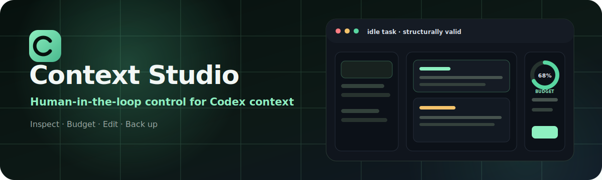
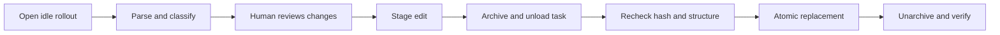

<div align="center">



# Codex Context Studio

**A local, human-in-the-loop workbench for inspecting, budgeting, and carefully editing Codex rollout context.**

[简体中文](README.zh-CN.md) · **English**

[](LICENSE)
[](package.json)
[](package.json)
[](#project-status)

</div>

> [!WARNING]
> Context Studio edits Codex's private on-disk session format. That format is not a stable public API. Use disposable tasks first, keep independent backups, and never edit a running task.

## Why Context Studio?

Long Codex tasks accumulate messages, reasoning state, tool transactions, skill injections, images, and compaction snapshots. Context Studio turns that opaque JSONL history into a reviewable interface—with structural guardrails around every write.

| Understand | Reduce | Protect |
| --- | --- | --- |
| See model-visible history, compaction boundaries, roles, tools, and official token usage. | Edit allowed text, remove completed whole transactions, and preview the active-context impact. | Recheck idle state, detect races, validate structure, create an immutable original backup, and replace atomically. |

## Highlights

- **Visual rollout explorer** — browse tasks by title, parent/child relationship, lifecycle state, and modification time.
- **Context-aware editing** — edit user/assistant text and matched string tool outputs; structural records stay locked.
- **Safe whole-item deletion** — remove completed reasoning, paired tool/MCP transactions, and pure skill fragments after the latest compaction.
- **Official token calibration** — combine per-item estimates with Codex `token_count` events.
- **Cache analytics** — latest-request and cumulative cache hit rates, plus cached and uncached input tokens.
- **Backup discipline** — one immutable pre-edit original, followed only by user-requested manual versions.
- **Race-resistant writes** — idle checks, SHA-256 comparison, archive/unload workflow, structural validation, and atomic replacement.
- **Light and dark themes** — responsive three-pane UI with a fast localhost browser workbench.
- **Zero runtime dependencies** — built on Node.js standard-library APIs.

## Safety model



Context Studio deliberately protects:

- developer and system instructions;
- tool schemas and dynamic tool definitions;
- session metadata, thread IDs, ordinals, timestamps, turn context, and world state;
- call IDs, tool names, non-string output structures, and encrypted reasoning metadata;
- incomplete turns and stale files.

These protections reduce risk; they cannot make a private, evolving storage format risk-free. Rollouts and backups may contain prompts, source code, credentials, local paths, and sensitive tool output.

## Quick start

### Requirements

- Node.js 20 or newer
- Codex Desktop for the embedded MCP App workflow
- Windows for the currently tested path; macOS and Linux are experimental

### Standalone inspection

```bash
git clone https://github.com/WenhaoHe02/context-studio.git
cd context-studio
npm test
npm start
```

The server binds to `127.0.0.1` only. Standalone mode supports inspection and manual backups. Direct save and restore are disabled by default because a browser process cannot safely unload a task held in Codex app-server memory.

Windows launcher:

```powershell
powershell -ExecutionPolicy Bypass -File .\scripts\start-context-studio.ps1
```

macOS/Linux launcher (experimental):

```bash
sh ./scripts/start-context-studio.sh
```

### Codex plugin

The plugin entry points are:

```text
.codex-plugin/plugin.json
.mcp.json
mcp/server.mjs
```

Install the repository through a local Codex marketplace or the plugin-development workflow supported by your Codex release. Open Context Studio from a separate controller task and select only an idle target task—never the controller task hosting the app.

The embedded workflow stages a write, asks Codex to archive/unload the target, commits the checked bytes, unarchives/reloads the task, and verifies the final hash.

## What can be changed?

| Record | Edit text | Delete whole item | Notes |
| --- | :---: | :---: | --- |
| User / assistant message | ✅ | ✅ | Completed history only for deletion |
| Matched string tool output | ✅ | ✅ | Call and output are deleted together |
| Reasoning state | ❌ | ✅ | Completed, post-compaction item only |
| Pure `<skill>` context | ❌ | ✅ | Whole fragment only |
| Developer / system context | ❌ | ❌ | Permanently protected |
| IDs, calls, schemas, world state | ❌ | ❌ | Structural context |

Changes before the latest compaction update the archival log but usually do not reduce the active model input. Active budgeting follows the replacement history and post-compaction suffix.

## Token and cache statistics

Per-item token values are explicitly estimates. The budget panel uses the latest non-zero official input usage event when available and avoids counting pre-compaction history twice.

Cache hit rate uses official rollout data:

```text
cache hit rate = cached_input_tokens / input_tokens
```

The UI reports both the latest request and cumulative session rate. Without a usable `token_count` event, it displays “unavailable” rather than inventing a value. External system prompts, tool schemas, memory, skill injection, and future Codex transformations cannot be reconstructed exactly from rollout text alone.

## Backups

- The first successful edit creates one immutable original snapshot.
- Later saves do **not** create automatic backup versions.
- Manual backup creates an explicit version.
- Restore does not create another backup automatically.
- `CONTEXT_STUDIO_BACKUP_DIR` can move backups to a separately protected directory.

## Recovery mode

Only when Codex is completely closed, standalone direct writes can be enabled for recovery:

```bash
CONTEXT_STUDIO_ALLOW_DIRECT_WRITE=1 npm start
```

PowerShell:

```powershell
$env:CONTEXT_STUDIO_ALLOW_DIRECT_WRITE = "1"
npm start
```

Never expose the HTTP server, recovery mode, or a Codex session directory to a LAN or the public internet.

## Architecture

```text
public/                 Browser UI
mcp/server.mjs          Embedded MCP App and guarded host workflow
server.mjs              Standalone localhost server
lib/rollout.mjs         Parser, classifier, token accounting, serializer
lib/staged-actions.mjs  Archive/commit/verify staging protocol
lib/backups.mjs         Immutable original and manual versions
lib/discovery.mjs       Task discovery and lifecycle checks
test/                   Synthetic rollout safety tests
```

## Platform support

| Platform | Status |
| --- | --- |
| Windows | Primary and tested |
| macOS | Experimental; community testing welcome |
| Linux | Experimental; community testing welcome |

## Project status

Context Studio is experimental. The fork feature is currently disabled in both UI and backend while registered-task and subagent-reuse semantics are redesigned.

Planned work:

- dedicated memory classification and visibility;
- safer registered-task fork semantics;
- macOS/Linux integration testing;
- richer token-history visualization;
- fixtures for future Codex rollout-format changes.

## Development

```bash
npm test
python /path/to/plugin-creator/scripts/validate_plugin.py .
```

Tests use temporary synthetic rollouts and must never target a real Codex session directory.

## Contributing

Contributions are welcome. Read [CONTRIBUTING.md](CONTRIBUTING.md) before opening a pull request. Please report vulnerabilities through the private process in [SECURITY.md](SECURITY.md), and never attach a real rollout or unredacted log to a public issue.

## License

[MIT](LICENSE) © 2026 [Wenhao He](https://github.com/WenhaoHe02)

