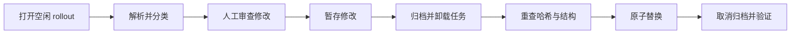

<div align="center">


# Codex Context Studio

**一个本地、Human-in-the-loop 的 Codex 上下文检查、预算与安全编辑工作台。**

**直接查看官方 Token 用量以及实时缓存命中率。**

**简体中文** · [English](README.md)

[](LICENSE)
[](package.json)
[](package.json)
[](#项目状态)

</div>

## 为什么需要 Context Studio？

长时间运行的 Codex 任务会积累消息、reasoning、工具事务、skill 注入、图片和 compaction 快照。Context Studio 把难以阅读的 JSONL 历史变成可审查的图形界面，并为每次写入设置结构保护。

| 看清上下文 | 减少上下文 | 保护数据 |
| --- | --- | --- |
| 查看模型可见历史、compaction 边界、角色、工具和官方 token 用量。 | 修改允许编辑的文本，删除已完成的完整事务，预览对有效上下文的影响。 | 重查空闲状态、检测竞态、验证结构、保存不可变原始备份并原子替换。 |

## 功能亮点

- **图形化 rollout 浏览器**：按任务标题、父子关系、运行状态和修改时间浏览。
- **上下文感知编辑**：允许修改用户/助手文本与匹配的字符串工具输出，结构字段始终锁定。
- **安全的整项删除**：删除最新 compaction 后已完成的 reasoning、成对工具/MCP 事务和纯 skill 片段。
- **官方 token 校准**：把条目估算与 Codex `token_count` 事件结合。
- **缓存命中率可视化**：在侧栏直接查看官方最近请求与会话累计命中率，并分别显示缓存与非缓存输入 Token。
- **克制的备份策略**：第一次编辑前生成唯一原始备份，后续版本仅由用户手动创建。
- **抗竞态写入**：空闲校验、SHA-256 对比、归档卸载、结构验证和原子替换。
- **暗色与亮色主题**：响应式三栏界面和高速 localhost 浏览器工作台。
- **零运行时依赖**：只使用 Node.js 标准库。

## 安全模型



以下内容受到强制保护：

- developer/system 指令；
- 工具 schema 与动态工具定义；
- 会话元数据、线程 ID、顺序号、时间戳、turn context 和 world state；
- call ID、工具名、非字符串输出和加密 reasoning 元数据；
- 未完成 turn 与已经变更的文件。

在已经测试的 Windows 环境中，受保护的查看、编辑、备份与恢复流程可以稳定运行。Codex 的本地格式仍可能随版本变化；rollout 与备份也可能包含提示词、源代码、凭据、本地路径和敏感工具输出。

## 快速开始

### 环境要求

- Node.js 20 或更高版本
- 嵌入式 MCP App 工作流需要 Codex Desktop
- 当前主要测试 Windows；macOS/Linux 为实验性支持

### 独立检查模式

```bash
git clone https://github.com/WenhaoHe02/context-studio.git
cd context-studio
npm test
npm start
```

服务只监听 `127.0.0.1`。独立模式支持查看与手动备份，但默认禁止直接保存和恢复，因为普通浏览器进程无法安全卸载 app-server 内存中的任务。

Windows 启动器：

```powershell
powershell -ExecutionPolicy Bypass -File .\scripts\start-context-studio.ps1
```

macOS/Linux 启动器（实验性）：

```bash
sh ./scripts/start-context-studio.sh
```

### 作为 Codex 插件

插件入口文件：

```text
.codex-plugin/plugin.json
.mcp.json
mcp/server.mjs
```

通过本地 Codex marketplace 或当前 Codex 版本支持的插件开发流程安装。请使用独立控制任务打开 Context Studio，只选择空闲目标，绝对不要选择承载应用自身的控制任务。

嵌入式写入流程会先暂存修改，再让 Codex 归档并卸载目标，提交校验后的字节，重新加载任务，最后核对哈希。

## 哪些内容可以修改？

| 记录 | 修改文本 | 整项删除 | 说明 |
| --- | :---: | :---: | --- |
| 用户/助手消息 | ✅ | ✅ | 只能删除已完成历史 |
| 匹配的字符串工具输出 | ✅ | ✅ | 调用与输出成对删除 |
| Reasoning 状态 | ❌ | ✅ | 仅限 compaction 后已完成项目 |
| 纯 `<skill>` 上下文 | ❌ | ✅ | 只能整体删除 |
| Developer/system 上下文 | ❌ | ❌ | 永久保护 |
| ID、调用、schema、world state | ❌ | ❌ | 结构上下文 |

修改最新 compaction 之前的内容会更新完整日志，但通常不会减少模型当前实际输入。有效预算以 replacement history 与 compaction 后缀为准。

## Token 与缓存统计

每个条目的 token 值都会明确标注为估算。预算面板会尽量使用最近一次非零官方输入统计校准，并避免重复计算 compaction 前历史。

缓存命中率使用 rollout 中的官方数据：

```text
缓存命中率 = cached_input_tokens / input_tokens
```

界面同时显示最近请求与会话累计命中率。没有可用 `token_count` 事件时显示“暂无官方统计”，不会编造数值。仅凭 rollout 文本无法精确重建外部 system prompt、工具 schema、memory、skill 注入和未来 Codex 转换。

## 备份策略

- 第一次成功编辑前创建唯一、不可变的原始快照。
- 后续保存不会自动不断生成备份版本。
- “手动备份”才会创建新版本。
- 恢复操作不会自动再套一层备份。
- 可用 `CONTEXT_STUDIO_BACKUP_DIR` 把备份放到单独保护的目录。

## 恢复模式

只有 Codex 完全关闭时，才可以为独立服务启用恢复模式直接写入：

```bash
CONTEXT_STUDIO_ALLOW_DIRECT_WRITE=1 npm start
```

PowerShell：

```powershell
$env:CONTEXT_STUDIO_ALLOW_DIRECT_WRITE = "1"
npm start
```

不要把 HTTP 服务、恢复模式或 Codex 会话目录暴露到局域网或公网。

## 项目结构

```text
public/                 浏览器 UI
mcp/server.mjs          嵌入式 MCP App 与受保护宿主流程
server.mjs              独立 localhost 服务
lib/rollout.mjs         解析、分类、token 统计和序列化
lib/staged-actions.mjs  归档/提交/验证暂存协议
lib/backups.mjs         不可变原始备份与手动版本
lib/discovery.mjs       任务发现与生命周期检查
test/                   合成 rollout 安全测试
```

## 平台支持

| 平台 | 状态 |
| --- | --- |
| Windows | 主要支持并持续测试 |
| macOS | 实验性，欢迎社区测试 |
| Linux | 实验性，欢迎社区测试 |

## 项目状态

Context Studio 目前处于 Beta 阶段。在已经测试的 Windows 环境中，受保护的查看、编辑、备份、恢复、Token 预算与浏览器工作台流程可以稳定运行。Fork 功能仍在 UI 与后端同时暂停，直到“正常注册任务”和“子代理复用”语义可以被安全实现。

计划方向：

- 独立 Memory 分类与可见性；
- 更安全的官方注册任务 Fork；
- macOS/Linux 集成测试；
- 更丰富的 token 历史图表；
- 为未来 Codex rollout 格式建立兼容 fixtures。

## 开发与测试

```bash
npm test
python /path/to/plugin-creator/scripts/validate_plugin.py .
```

测试只使用临时合成 rollout，绝对不要把测试指向真实 Codex 会话目录。

## 参与贡献

欢迎贡献。提交 PR 前请阅读 [CONTRIBUTING.md](CONTRIBUTING.md)。安全问题请按 [SECURITY.md](SECURITY.md) 的私密流程报告，不要在公开 issue 中上传真实 rollout 或未脱敏日志。

## 许可证

[MIT](LICENSE) © 2026 [Wenhao He](https://github.com/WenhaoHe02)
